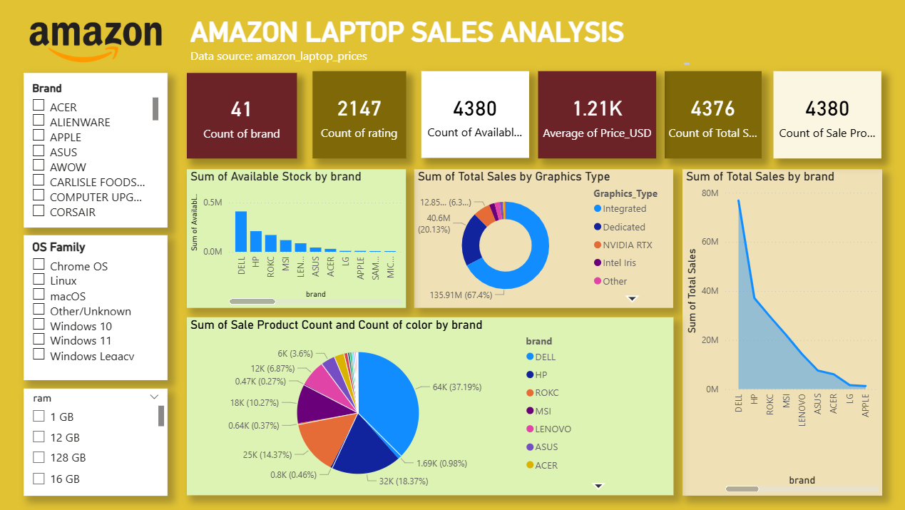

# Amazon Laptop Sales Analysis Dashboard

## Project Overview

This project analyzes Amazon laptop sales data using **Power BI** to generate interactive visualizations and insights.
It focuses on understanding pricing patterns, brand performance, product demand, and stock availability.

---

## Project Structure

```
amazon-laptop-sales-analysis/
│
├── amazon_laptop_prices.csv                # Raw dataset
├── amazon_laptop_sales_data_dashboard.pbix # Final dashboard (main file)
│
├── assets/
│   └── amazon-laptop-sales-analysis-dashboard.png  # Dashboard preview
```

---

## Dataset Description

The dataset contains information about laptops listed on Amazon, including:

* Brand & Model
* Screen Size & Color
* CPU & RAM
* Operating System
* Price & Ratings
* Total Sales & Stock Availability

### Key Columns:

* `brand`
* `model`
* `Price`
* `rating`
* `Total Sales`
* `Available Stock`
* `Sale Product Count`

---

## Tools & Technologies Used

* **Power BI (.pbix)**
* **CSV Dataset**
* Data Cleaning & Transformation (Power Query)
* Data Visualization

---

## Steps Followed in the Project

### 1. Data Collection

* Imported dataset from `amazon_laptop_prices.csv`.

### 2. Data Cleaning (Power Query)

* Handled missing values (e.g., model, cpu_speed).
* Converted data types (Price → numeric, ratings → decimal).
* Removed inconsistencies and null entries.

### 3. Data Transformation

* Created calculated fields:

  * Total Revenue
  * Average Rating
  * Stock vs Sales comparison
* Cleaned currency values by removing `$`.

### 4. Data Modeling

* Structured dataset for efficient reporting.
* Ensured relationships (if multiple tables used).

### 5. Dashboard Creation

Built interactive visuals:

* Total Sales Overview
* Brand-wise Performance
* Rating Distribution
* Price vs Sales Analysis
* Stock Availability

### 6. Final Dashboard

* Saved in:
  `amazon_laptop_sales_data_dashboard.pbix`

---

## How to Run the Project

### Prerequisites

* Install **Microsoft Power BI Desktop**

### Steps

1. Clone or download this repository:

   ```
   git clone https://github.com/aishks14/amazon-laptop-sales-powerbi-dashboard.git
   ```

2. Navigate to the project folder.

3. Open the file:

   ```
   amazon_laptop_sales_data_dashboard.pbix
   ```

4. If prompted:

   * Reconnect dataset to `amazon_laptop_prices.csv`

5. Click **Refresh** to load data.

6. Explore the dashboard visuals.

---

## Dashboard Preview



---

## Key Insights (Example)

* Apple laptops show high revenue despite lower volume.
* Mid-range laptops dominate sales volume.
* High-rated products correlate with better sales.
* Stock availability impacts sales performance.

---

## Future Improvements

* Add time-series analysis (monthly trends)
* Include more datasets (reviews, categories)
* Deploy dashboard to Power BI Service